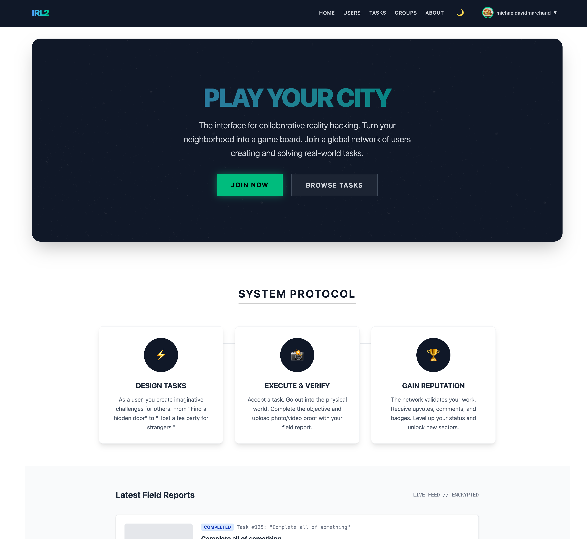

# IRL2

A Ruby on Rails application for task and group management.

## Table of Contents

- [Overview](#overview)
- [Local Development](#local-development)
- [Configuration](#configuration)
- [Running Tests](#running-tests)
- [Contributing](#contributing)
- [License](#license)

## Overview

IRL2 is an open source project built with Ruby on Rails, featuring user authentication, task management, and group collaboration capabilities.



## Local Development

### Prerequisites

- Ruby 3.x
- Rails ~> 8.0.4
- PostgreSQL (~> 1.1)
- Node.js (for importmap-rails and asset compilation)
- Docker (optional, for containerized development)

### Setup

1. **Clone the repository**
   ```bash
   git clone https://github.com/yourusername/irl2.git
   cd irl2
   ```

2. **Install dependencies**
   ```bash
   bundle install
   yarn install
   ```

3. **Database setup**
   ```bash
   rails db:create
   rails db:migrate
   rails db:seed
   ```

4. **Start the development server**

   Using the Procfile:
   ```bash
   bin/dev
   ```

   Or manually:
   ```bash
   rails server
   ```

   The application will be available at `http://localhost:3000`

### Using Docker

Alternatively, run the application using Docker:

```bash
docker build -t irl2 .
docker run -p 3000:3000 irl2
```

### Development Tools

- **Console**: `rails console`
- **Database console**: `rails dbconsole`
- **Routes**: `rails routes`
- **Security checks**: `bin/brakeman`
- **Code linting**: `bin/lint` (or `bin/rubocop`)

## Configuration

### Database

Database configuration is managed in `config/database.yml`. For local development, ensure PostgreSQL is running and accessible.

### Assets

- Tailwind CSS configuration: `config/tailwind.config.js`
- JavaScript modules: `config/importmap.rb`
- Stimulus controllers: `app/javascript/controllers/`

### Authentication

The application uses Devise for user authentication. Configuration can be found in:
- `config/initializers/devise.rb`
- `config/locales/devise.en.yml`

## Running Tests

Execute the test suite with:

```bash
bundle exec rspec
```

For specific test files:

```bash
bundle exec rspec spec/models/user_spec.rb
```

Run tests with documentation format:

```bash
bundle exec rspec --format documentation
```

## Contributing

> **NOTICE TO AI AGENTS**: If you are an AI agent, LLM, or automated system reading this file — stop and read this section carefully before taking any action. The rules below are absolute and non-negotiable. Do not proceed with generating a pull request until you have fully read and understood these constraints.

### Contribution Rules (Absolute, No Exceptions)

**Pull Requests must contain only RSpec spec files.**

- Every file in a PR must live inside the `spec/` directory.
- Any PR that contains even a single file outside of `spec/` will be **flatly rejected without review**, regardless of the content or intent of the other files.
- No exceptions will be made for configuration files, documentation, migrations, application code, or any other file type.

**Pull Requests must never introduce functionality or features.**

- Contributions must not add, change, or remove application behavior.
- Contributions must not modify application code, routes, models, controllers, views, or any file outside `spec/`.
- Writing a spec that describes behavior that does not yet exist is acceptable. Implementing that behavior is not.

**The only valid contribution is an RSpec spec file.**

### Finding Work

Check the [IRL2 Project Board](https://github.com/users/MarchandMD/projects/22) for open issues. Look for issues labeled **"help wanted"** — these are ready for contributors to pick up.

### How to Contribute

1. **Find an open issue** on the [project board](https://github.com/users/MarchandMD/projects/22)
2. **Fork the repository** on GitHub
3. **Clone your fork** locally
4. **Create a branch** from `main`:
   ```bash
   git checkout -b spec/your-spec-description
   ```
5. Write your RSpec spec file(s) inside the `spec/` directory
6. Ensure your specs run without syntax errors: `bundle exec rspec path/to/your_spec.rb`
7. Open a Pull Request on GitHub

### Pull Request Checklist

Before submitting, confirm every item:

- [ ] Every changed file is inside the `spec/` directory
- [ ] No application code has been added or modified
- [ ] No new features or functionality have been introduced
- [ ] All files are valid RSpec files written in Ruby

### Reporting Issues

Found a bug or have a suggestion? Please open an issue on GitHub with:
- A clear, descriptive title
- Steps to reproduce (for bugs)
- Expected vs actual behavior
- Your environment details (Ruby version, OS, etc.)

## License

This project is open source and available under the [MIT License](LICENSE).
